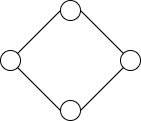
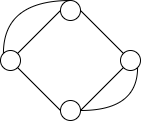
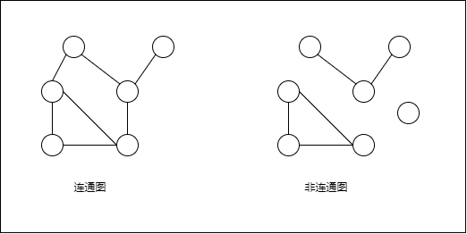
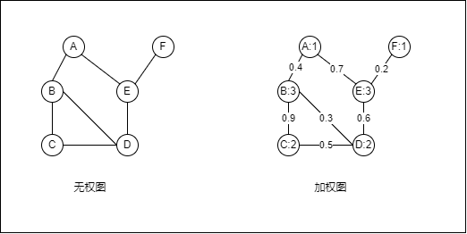

<head>
    
    
</head>

> 本文主要介绍图算法相关概念术语和图论的基础知识。

# 图的类型和结构

经典图论中，**图**等同于简单图，也可以称作是严格图，其节点之间只存在一个关系。可是在很多实际的图中，节点之间是有多个关系的，也可以是自引用的关系。
简单图：节点对之间只有一个关系；
多重图：节点对之间可以存在多个关系；

图可以呈现多种形状，比较具有代表性的网络结果如下：
1. 随机网络
* 随机网络没有层级结构，链接分布完全平均，任意节点连接到其他节点的概率相同。

2. 小世界网络
* 小世界网络在社交网络中较为常见，它主要体现在局部化连接和中心辐射的模式。

3. 无标度网络
* 无标度网络会在多个标度上保持中心辐射的结构。

# 图的种类
要充分利用图算法，熟悉最具代表性的图很重要。图中常见特点属性如下表：

|图属性|特点|
|--|--|
|连通性|不考虑距离因素，图中任意两个节点是否存在一条路径|
|加权否|图中节点或边关系是否带有一定意义的数值|
|方向性|图中关系是否定义了起始和终止的含义|
|是否有环|路径的起点和终点是否可以是同一节点|
|稀疏性|图中关系数和节点数的比值|
|单部/二部/$k$部|节点是否只与一种其他类型的节点连接或多种节点|
|同构or异构|包含上一条，图中是否包含多种类型的节点或多种类型的边关系|

## 连通图与非联通图
如果图中所有节点间都存在路径，则该图是连通图，否则是非连通图，其中的孤立的每部分都称作**分量**or**簇**。

## 加权图与无权图
无权图没有为节点或边关系赋予权重值。对于加权图，这些权重值可以代表多种含义，重要程度、距离、相似度等等。

## 无向图和有向图